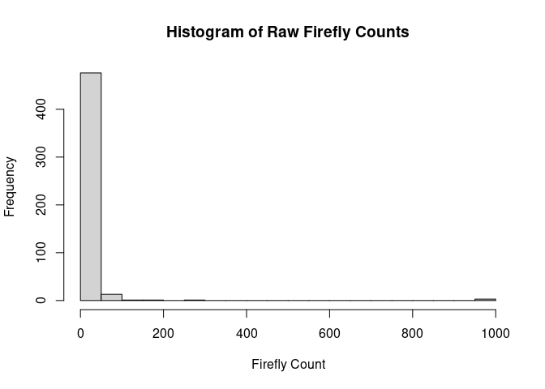

Final Report
================
Alexia Shumway
2025-10-29

- [ABSTRACT](#abstract)
- [BACKGROUND](#background)
- [STUDY QUESTIONS AND HYPOTHESIS](#study-questions-and-hypothesis)
  - [Study Question](#study-question)
  - [Hypothesis](#hypothesis)
  - [Prediction](#prediction)
- [METHODS](#methods)
  - [Firefly Abundance by Region
    Boxplot](#firefly-abundance-by-region-boxplot)
  - [Two Sample T-Test](#two-sample-t-test)
- [DICUSSION](#dicussion)
- [CONCLUSION](#conclusion)
- [REFERENCES](#references)

# ABSTRACT

# BACKGROUND

# STUDY QUESTIONS AND HYPOTHESIS

## Study Question

## Hypothesis

## Prediction

# METHODS

## Firefly Abundance by Region Boxplot

``` r
# Firefly Boxplot

# Load needed packages
library(ggplot2)
library(stringi)

# Read in the dad
fireflies <- read.csv("Usable Data Fireflies - Usable Data (1).csv", stringsAsFactors = FALSE)

# Rename columns to simpler names
colnames(fireflies) <- c("firefly_count", "region")

# Diagnostics
cat("Original region values:\n")
```

    ## Original region values:

``` r
print(unique(fireflies$region))
```

    ## [1] "north" "south" ""

``` r
cat("\nCounts by region (before cleaning):\n")
```

    ## 
    ## Counts by region (before cleaning):

``` r
print(as.data.frame(table(region = fireflies$region, useNA = "ifany")))
```

    ##   region Freq
    ## 1           2
    ## 2  north  434
    ## 3  south   61

``` r
# Replace blanks with NA
fireflies$region[fireflies$region == ""] <- NA

# Normalize 
fireflies$region <- stri_trans_general(fireflies$region, "NFKC")

# Remove invisible characters
fireflies$region <- stri_replace_all_regex(fireflies$region, "\\p{C}", "")

# Convert non-breaking spaces to regular and trim spaces
fireflies$region <- gsub("\u00A0", " ", fireflies$region)
fireflies$region <- trimws(fireflies$region)

# Convert to lowercase
fireflies$region <- tolower(fireflies$region)

# Fix obvious typos or abbreviations
fireflies$region[fireflies$region %in% c("n", "nrth", "noth")] <- "north"
fireflies$region[fireflies$region %in% c("s", "sth", "soth")] <- "south"

# Keep valid categories
fireflies$region <- factor(fireflies$region, levels = c("north", "south"))
fireflies_clean <- droplevels(subset(fireflies, !is.na(region)))

# Check column names
cat("\nUnique cleaned region values:\n")
```

    ## 
    ## Unique cleaned region values:

``` r
print(unique(fireflies_clean$region))
```

    ## [1] north south
    ## Levels: north south

``` r
cat("\nCounts by region (after cleaning):\n")
```

    ## 
    ## Counts by region (after cleaning):

``` r
print(as.data.frame(table(region = fireflies_clean$region)))
```

    ##   region Freq
    ## 1  north  434
    ## 2  south   61

``` r
#Box Plot
ggplot(fireflies_clean, aes(x = region, y = firefly_count, fill = region)) +
  geom_boxplot(width = 0.6, color = "black", alpha = 0.7) +  # clean, solid boxes
  labs(
    title = "Firefly Abundance by Region",
    x = "Region",
    y = "Firefly Count"
  ) +
  scale_fill_manual(values = c("north" = "#8EC9E8", "south" = "#F4A261")) +  # subtle professional palette
  coord_cartesian(ylim = c(0, 50)) +
  theme_minimal(base_size = 13) +
  theme(
    legend.position = "none",
    plot.title = element_text(size = 16, face = "bold", hjust = 0.5),
    axis.text = element_text(size = 12),
    axis.title = element_text(size = 13),
    panel.grid.major.x = element_blank(),
    panel.grid.minor = element_blank()
  )
```

    ## Warning: Removed 1 row containing non-finite outside the scale range
    ## (`stat_boxplot()`).

<!-- -->

## Two Sample T-Test

``` r
# Load packages
library(ggplot2)
library(stringi)
library(dplyr)

# Read in data
fireflies <- read.csv("Usable Data Fireflies - Usable Data (1).csv", stringsAsFactors = FALSE)

# Ensure correct column naming
colnames(fireflies) <- c("firefly_count", "region")

# Convert firefly_count to numeric & handle blanks
fireflies$firefly_count <- suppressWarnings(as.numeric(fireflies$firefly_count))
fireflies$firefly_count[fireflies$firefly_count < 0] <- NA  # Remove impossible values if any

# Clean region column
fireflies$region <- trimws(fireflies$region)
fireflies$region[fireflies$region == ""] <- NA
fireflies$region <- stri_trans_general(fireflies$region, "NFKC")
fireflies$region <- tolower(fireflies$region)

# Fix region typos and mislabeled data
fireflies$region[fireflies$region %in% c("n", "nrth", "noth", "north ", "northwest")] <- "north"
fireflies$region[fireflies$region %in% c("s", "sth", "soth", "south ", "southeast")] <- "south"

# Keep only valid data
fireflies_clean <- fireflies %>%
  filter(region %in% c("north", "south"), !is.na(firefly_count))

fireflies_clean$region <- factor(fireflies_clean$region)

# Diagnostic check
cat("Counts in each group:\n")
```

    ## Counts in each group:

``` r
print(table(fireflies_clean$region))
```

    ## 
    ## north south 
    ##   433    61

``` r
cat("\nSummary of firefly counts:\n")
```

    ## 
    ## Summary of firefly counts:

``` r
print(summary(fireflies_clean$firefly_count))
```

    ##    Min. 1st Qu.  Median    Mean 3rd Qu.    Max. 
    ##    1.00    2.00    4.00   17.43   10.00 1000.00

``` r
# T-Test
ttest_results <- t.test(firefly_count ~ region, data = fireflies_clean)

cat("\nT-test Results:\n")
```

    ## 
    ## T-test Results:

``` r
print(ttest_results)
```

    ## 
    ##  Welch Two Sample t-test
    ## 
    ## data:  firefly_count by region
    ## t = -1.2716, df = 61.533, p-value = 0.2083
    ## alternative hypothesis: true difference in means between group north and group south is not equal to 0
    ## 95 percent confidence interval:
    ##  -75.33068  16.75983
    ## sample estimates:
    ## mean in group north mean in group south 
    ##            13.81293            43.09836

# DICUSSION

# CONCLUSION

# REFERENCES
