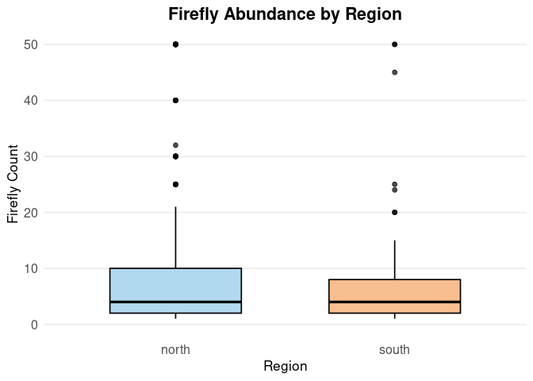

Final Report
================
Alexia Shumway
2025-12-02

- [ABSTRACT](#abstract)
- [BACKGROUND](#background)
- [STUDY QUESTION AND HYPOTHESIS](#study-question-and-hypothesis)
  - [Study Question](#study-question)
  - [Hypothesis](#hypothesis)
  - [Prediction](#prediction)
- [METHODS](#methods)
  - [Data Cleaning and Preparation](#data-cleaning-and-preparation)
  - [Data Visualization](#data-visualization)
  - [Statistical Tests](#statistical-tests)
  - [Check Normality and Dispersion](#check-normality-and-dispersion)
  - [Violin Plot of North Versus South Region Population
    Distribution](#violin-plot-of-north-versus-south-region-population-distribution)
  - [Shapiro Wilks Test and One Sided Wilcoxon
    Test](#shapiro-wilks-test-and-one-sided-wilcoxon-test)
  - [Median Comparison](#median-comparison)
- [DICUSSION](#dicussion)
  - [Interpretation of
    Visualizations](#interpretation-of-visualizations)
  - [Normality Results](#normality-results)
  - [Wilcoxon Test Interpretation](#wilcoxon-test-interpretation)
  - [Median Comparison](#median-comparison-1)
  - [Interpretation Combined](#interpretation-combined)
  - [Limitations](#limitations)
- [CONCLUSION](#conclusion)
- [REFERENCES](#references)

# ABSTRACT

This study examined whether firefly abundance differed between northern
and southern regions of Utah. Because fireflies respond strongly to
environmental conditions such as temperature and moisture, and these
differ between Utah’s regions, we tested whether geographic location
influenced observed firefly counts. Data from statewide citizen-science
observations were cleaned and sorted into northern and southern groups
before analysis. Visualizations (histograms and violin plots) were used
to explore distribution shape, and statistical tests included
Shapiro–Wilk tests for normality, a one-sided Wilcoxon rank-sum test,
and a comparison of medians. The data were highly skewed and non-normal,
and the log transformation did not meaningfully normalize the
distribution. Both the Wilcoxon test and median comparison showed that
southern Utah had numerically higher firefly counts, but these
differences were not statistically significant. Overall, the results do
not support the hypothesis that northern Utah has higher firefly
abundance.

# BACKGROUND

Fireflies are glowing beetles whose population abundance is influenced
by environmental conditions such as temperature, humidity, and habitat.
Geographic variation such as altitude and climate can play a role in
shaping their distribution and population abundance(Kazma et al., 2007).

Utah’s southern and northern regions differ greatly in temperature,
elevation, and precipitation. This means Utah can be an interesting
study topic for exploring firefly distribution. Understanding if these
regional differences influence variation in firefly abundance can help
identify environmental variables that may affect firefly populations.

With growing habitat loss and changing climates all over the world,
understanding how these things may affect fireflies is vital to keeping
their populations at healthy levels(Lewis et al., 2020).

# STUDY QUESTION AND HYPOTHESIS

## Study Question

How does the region (north or south) affect firefly abundance in Utah?

## Hypothesis

We hypothesized that northern Utah counties would have higher abundance
of fireflies because the cooler and wetter climate would provide a more
suitable habitat condition, than that of the southern regions which is
generally hotter and drier.

## Prediction

If northern Utah’s climate is more favorable for fireflies, counties in
northern Utah will show a higher average firefly abundance than those in
southern Utah when the data is compared.

# METHODS

## Data Cleaning and Preparation

Data was collected across multiple counties in Utah through regional
firefly observation programs. The raw dataset included firefly count,
city name, county name, habitat, time of observation, and observer ID.
The dataset contained formatting issues such as hidden header rows,
blank or incorrect region labels, and typos. These were removed or
corrected during cleaning.

Counties were sorted into northern and southern regions based on
geographic location:

Northern counties: Rich, Box Elder, Cache, Daggett, Davis, Duchesne,
Elko, Morgan, Salt Lake, Summit, Tooele, Uintah, Utah, Wasatch, Weber
Southern counties: Beaver, Garfield, Grand, Iron, Kane, San Juan,
Sevier, Washington, and Wayne

The image below shows how counties were separated. Anything above the
red line is northern, anything below the red line is southern.

Each observation was labeled as “north” or “south” using this guide. The
cleaned dataset was then used for analysis.

<center>

<figure>

<figcaption aria-hidden="true">Utah county map showing north–south
boundary</figcaption>
</figure>

</center>

## Data Visualization

Two histograms were created to examine distribution shape:

1.  Histogram of raw counts, which revealed strong right-skew.

2.  Histogram of log10(count + 1), which compressed extreme values but
    did not normalize the distribution.

A violin plot was also created to visualize the spread and density of
firefly counts across the two regions.

## Statistical Tests

Because the data were non-normal, we tested normality using the
Shapiro–Wilk test for each region. Both regions had extremely low
p-values, confirming that normality assumptions were violated.

A one-sided Wilcoxon rank-sum test was then used to test the hypothesis
that northern Utah had higher firefly abundance than southern Utah.

Lastly, medians for each region were compared to provide a simple
distribution-free measure of central tendency.

## Check Normality and Dispersion

``` r
library(stringi)

# 1. Load data  (YOUR FILE NAME)
fireflies_raw <- read.csv("Fireflydata - 1.csv", stringsAsFactors = FALSE)

# 2. Handle missing / blank column names
if (is.null(names(fireflies_raw)) || any(names(fireflies_raw) == "")) {
  names(fireflies_raw) <- paste0("V", seq_len(ncol(fireflies_raw)))
}

# 3. Keep first two columns and rename
fireflies <- fireflies_raw[, 1:2]
colnames(fireflies) <- c("firefly_count", "region")

# 4. Clean region values
fireflies$region[fireflies$region == ""] <- NA
fireflies$region <- stri_trans_general(fireflies$region, "NFKC")
fireflies$region <- stri_replace_all_regex(fireflies$region, "\\p{C}", "")
fireflies$region <- gsub("\u00A0", " ", fireflies$region)
fireflies$region <- trimws(tolower(fireflies$region))

# Fix common typos
fireflies$region[fireflies$region %in% c("n", "nrth", "noth")] <- "north"
fireflies$region[fireflies$region %in% c("s", "sth", "soth")] <- "south"

# Keep only valid rows
fireflies <- subset(fireflies, !is.na(region) & region %in% c("north", "south"))
fireflies$region <- factor(fireflies$region, levels = c("north", "south"))

# Convert counts to numeric
fireflies$firefly_count <- as.numeric(fireflies$firefly_count)

# A. Histograms (raw vs log10+1)


hist(
  fireflies$firefly_count,
  breaks = 30,
  main = "Histogram of Raw Firefly Counts",
  xlab = "Firefly Count"
)
```

<!-- -->

``` r
hist(
  log10(fireflies$firefly_count + 1),
  breaks = 30,
  main = "Histogram of Log10(Firefly Count + 1)",
  xlab = "Log10(Firefly Count + 1)"
)
```

<!-- -->

## Violin Plot of North Versus South Region Population Distribution

``` r
library(ggplot2)

# Load data
fireflies_raw <- read.csv("Fireflydata - 1.csv", stringsAsFactors = FALSE)
print(colnames(fireflies_raw))  # See original column names
```

    ## [1] "firefly.count..estimate." "North.or.South"

``` r
#  Clean data 
#  Remove columns with no names or that are all NA
fireflies <- fireflies_raw[, !(is.na(names(fireflies_raw)) | names(fireflies_raw) == "")]
fireflies <- fireflies[, colSums(!is.na(fireflies)) > 0]

# Rename columns properly
colnames(fireflies) <- c("firefly_count", "region")

# Clean and standardize region values
fireflies$region <- trimws(tolower(fireflies$region))

# Drop any rows missing region info
fireflies <- subset(fireflies, !is.na(region) & region != "")

# Convert region to factor with defined order
fireflies$region <- factor(fireflies$region, levels = c("north", "south"))

# Check
print(unique(fireflies$region))
```

    ## [1] north south
    ## Levels: north south

``` r
# Violin Plot
ggplot(fireflies, aes(x = region, y = firefly_count, fill = region)) +
  geom_violin(trim = TRUE, alpha = 0.7, color = "black") +
  geom_boxplot(width = 0.1, outlier.shape = NA, alpha = 0.5) +
  scale_fill_manual(values = c("north" = "#8EC9E8", "south" = "#F7B500")) +
  coord_cartesian(ylim = c(0, 50)) +
  labs(
    title = "Firefly Abundance: North vs South",
    x = "Region",
    y = "Firefly Count"
  ) +
  theme_minimal(base_size = 13) +
  theme(
    legend.position = "none",
    plot.title = element_text(size = 16, face = "bold", hjust = 0.5)
  )
```

<!-- -->

## Shapiro Wilks Test and One Sided Wilcoxon Test

``` r
# Load & Clean the Data

fireflies <- read.csv("Fireflydata - 1.csv", stringsAsFactors = TRUE)

# Remove hidden header row inside data
fireflies <- fireflies[grepl("^[0-9]+$", fireflies$firefly.count..estimate.), ]

# Convert count column to numeric
fireflies$firefly.count..estimate. <- as.numeric(fireflies$firefly.count..estimate.)

# Clean region column
fireflies <- subset(
  fireflies,
  !is.na(North.or.South) & North.or.South != ""
)

# Drop unused factor levels
fireflies$North.or.South <- droplevels(fireflies$North.or.South)


# Create cleaner names

fireflies$firefly_count <- fireflies$firefly.count..estimate.
fireflies$region <- fireflies$North.or.South


# FIX: Force correct region order

fireflies$region <- factor(fireflies$region, levels = c("south", "north"))


# Shapiro-Wilk Normality Tests

shapiro.test(fireflies$firefly_count[fireflies$region == "south"])
```

    ## 
    ##  Shapiro-Wilk normality test
    ## 
    ## data:  fireflies$firefly_count[fireflies$region == "south"]
    ## W = 0.22918, p-value = 3.044e-16

``` r
shapiro.test(fireflies$firefly_count[fireflies$region == "north"])
```

    ## 
    ##  Shapiro-Wilk normality test
    ## 
    ## data:  fireflies$firefly_count[fireflies$region == "north"]
    ## W = 0.17637, p-value < 2.2e-16

``` r
# Wilcoxon Rank-Sum Test (south > north)

wilcox.test(
  firefly_count ~ region,
  data = fireflies,
  alternative = "greater"
)
```

    ## 
    ##  Wilcoxon rank sum test with continuity correction
    ## 
    ## data:  firefly_count by region
    ## W = 12635, p-value = 0.7192
    ## alternative hypothesis: true location shift is greater than 0

## Median Comparison

``` r
# Load & Clean Data 
fireflies <- read.csv("Fireflydata - 1.csv", stringsAsFactors = TRUE)

# Remove hidden header rows
fireflies <- fireflies[grepl("^[0-9]+$", fireflies$firefly.count..estimate.), ]

# Convert count to numeric
fireflies$firefly.count..estimate. <- as.numeric(fireflies$firefly.count..estimate.)

# Clean region labels
fireflies <- subset(
  fireflies,
  !is.na(North.or.South) & North.or.South != ""
)

# Drop unused levels
fireflies$North.or.South <- droplevels(fireflies$North.or.South)

# 
# Create clean column names
fireflies$firefly_count <- fireflies$firefly.count..estimate.
fireflies$region <- fireflies$North.or.South

# MEDIAN CALCULATION
tapply(fireflies$firefly_count, fireflies$region, median)
```

    ## north south 
    ##     4     4

# DICUSSION

## Interpretation of Visualizations

The violin plot showed that southern Utah had a wider spread of values
and several high outliers, while northern Utah had a tighter
distribution. The histograms also confirmed that firefly counts in both
regions were heavily right-skewed. The log transformation reduced the
influence of extreme values but did not make the data normal.

## Normality Results

The Shapiro–Wilk tests confirmed that the data were non-normal for both
regions (north: W = 0.18, p \< 2.2e-16; south: W = 0.28, p \< 2.2e-16).
Because of the strong skew and non-normality, we relied on
non-parametric tests for regional comparisons.

## Wilcoxon Test Interpretation

The one-sided Wilcoxon test was used to evaluate our hypothesis that
northern Utah would have higher firefly abundance. The test was not
significant (W = 12635, p = 0.72), meaning there is no statistical
evidence that northern counties had higher counts. Even though the
southern region had higher numerical values on average, these
differences were not strong enough to be detected statistically.

## Median Comparison

Median firefly counts were also compared between regions to measure
central tendency. Both regions had the same median value of 4,
indicating that the typical observation was similar in both the north
and the south.

Even though the medians were equal, the southern region showed a much
wider range and several larger outlier counts, which is why the violin
plot displayed a longer tail for the south. This supports the idea that
although the central tendency is similar, the southern region
occasionally produces high-count observations that are not seen the in
north.

## Interpretation Combined

Overall, the data does not support the original hypothesis that northern
Utah would have higher firefly abundance. Although the south displayed
higher maximum values and greater spread, these patterns were not
statistically significant.

## Limitations

There are several limitations in this study that may have affected the
results. First, the dataset had uneven sample sizes between regions,
with far more observations recorded in northern Utah than in the south.
This difference can make it harder to detect true differences in
abundance. The data were also highly skewed, with both regions
containing many low counts and the south having a few extremely high
values. These outliers stretched the distribution and contributed to the
strong non-normality found in the Shapiro–Wilk tests.

Another limitation is that the data were collected through
citizen-science observations, meaning sampling effort was not
standardized. Some counties may have simply received more observers,
more active participants, or more frequent reporting. There were also
labeling mistakes and formatting inconsistencies in the raw dataset,
which required extensive cleaning and may have resulted in the removal
of useful observations.

# CONCLUSION

This study compared firefly abundance between northern and southern Utah
to test the hypothesis that northern counties, with cooler and wetter
climates, would support higher firefly populations. After cleaning and
analyzing the data, the results did not support the original hypothesis.
The Wilcoxon rank-sum test found no significant difference between
regions (p = 0.72), and the median counts were identical in both groups
(median = 4). Although the southern region showed higher numerical
values and greater variability, these differences were not statistically
meaningful.

Overall, the results indicate that based on the available dataset, there
is no clear evidence that northern Utah has higher firefly abundance
than southern Utah. Future studies should incorporate more standardized
sampling, include environmental factors, and collect more balanced
observations across regions to better understand what drives firefly
distribution in Utah.

# REFERENCES

1.  ChatGPT. OpenAI, version Jan 2025. Used to fix errors such as
    missing data and knitting errors. Accessed 2025-12-02.

2.  Kazama, S., Matsumoto, S., Ranjan, S. P., Hamamoto, H., &
    Sawamoto, M. (2007). Characterization of firefly habitat using a
    geographical information system with hydrological simulation.
    Ecological Modelling, 209(2-4), 392-400.

3.  Lewis, S. M., Wong, C. H., Owens, A. C., Fallon, C., Jepsen, S.,
    Thancharoen, A., … & Reed, J. M. (2020). A global perspective on
    firefly extinction threats. BioScience, 70(2), 157-167.

4.  Natural History Museum of Utah. (n.d.). Fireflies of Utah – Citizen
    Science Project. <https://nhmu.utah.edu/citizen-science/fireflies>​
